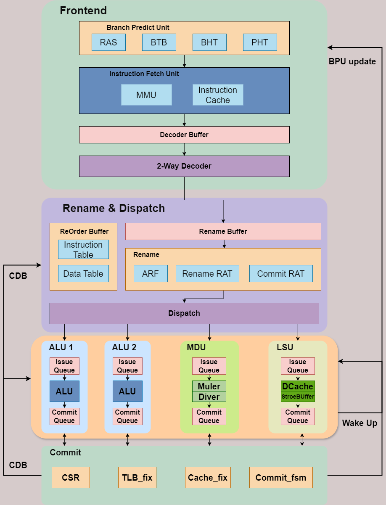
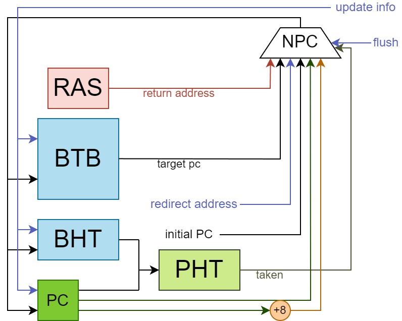
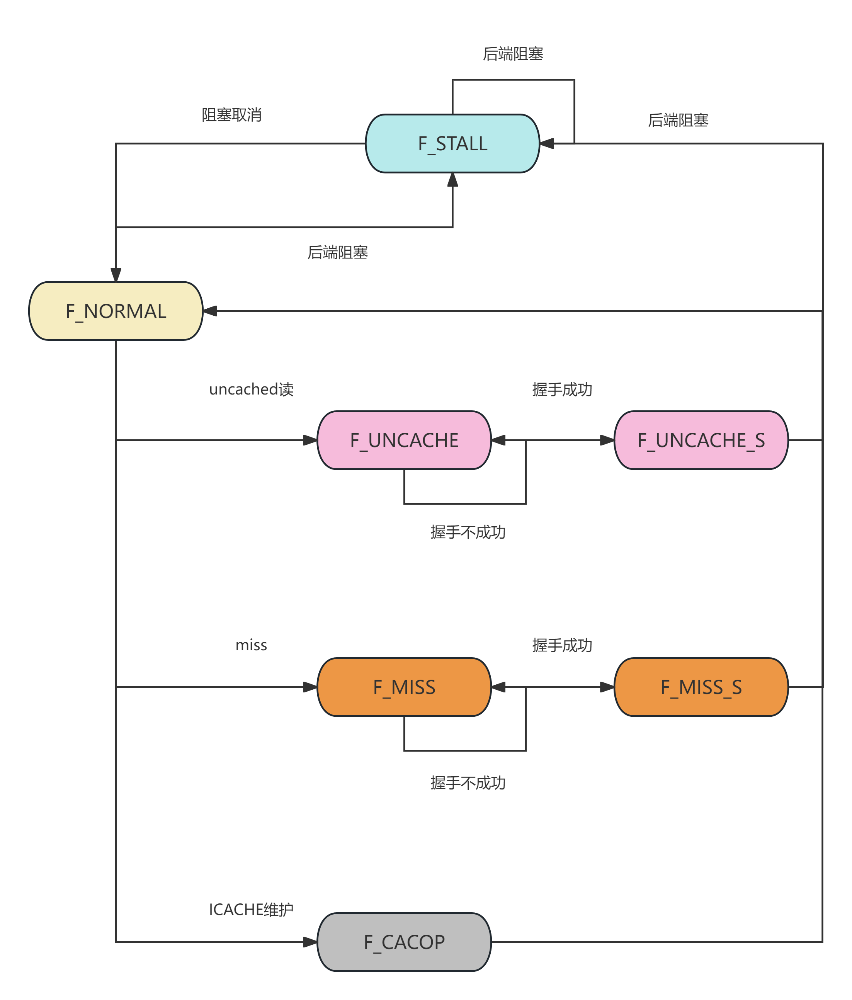
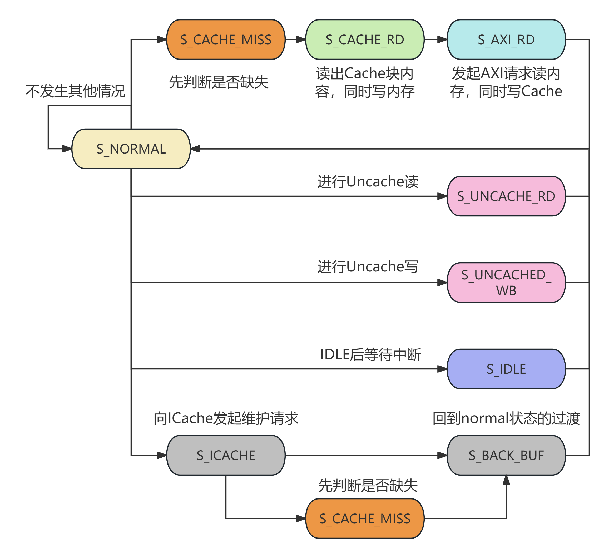
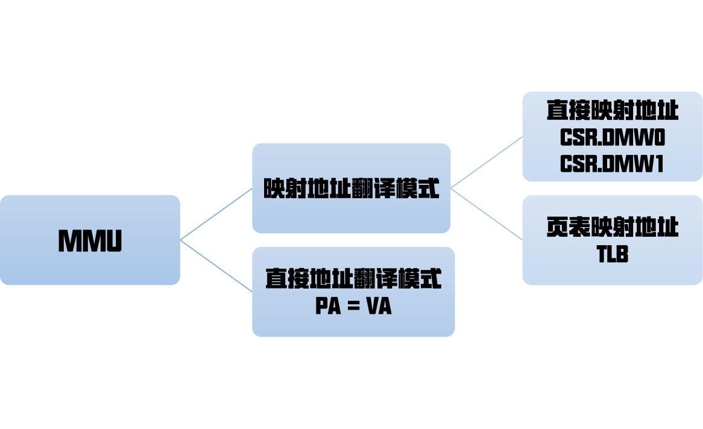

# BOOMCore设计报告

<div align="right">
北京航空航天大学 2 队 - BOOM 
</div>
<div align="right">
唐凌、卞卓航、汤睿璟、曾华旭
</div>
设计概述：
BOOM团队提交的处理器核心BOOMCore是一个级的乱序双发处理器，可以启动分支预测器和L1-Cache。⽀持 LoongArch32R指令集中除浮点指令外的全部功能，使⽤SystemVerilog硬件描述语⾔实现。

## 目录
- 一、CPU 内核设计
  - 1.1 总体设计
    - 1.1.1 前端 Frontend
    - 1.1.2 后端 Backend
    - 1.1.3 访存 Memory
  - 1.2 分支预测 Branch Predict
  - 1.3 取指 Inst Fetch
  - 1.4 译码 Decoder
  - 1.5 寄存器重命名 Rename
  - 1.6 分发 Dispatch
    - 1.6.1 填入ROB和读取数据
    - 1.6.2 分发逻辑
  - 1.7 发射 Issue
  - 1.8 执行 Execute
    - 1.8.1 算术逻辑指令 ALU
    - 1.8.2 乘除指令 MDU
    - 1.8.3 访存指令 LSU
  - 1.9 提交 Commit
    - 1.9.1 指令提交
    - 1.9.2 提交的访存逻辑
  - 1.10 地址翻译和TLB
- 二、参考模块
  - 2.1 DPSRAM
  - 2.2 寄存器堆
- 三、性能优化
  - 3.1 性能分数
  - 3.2 性能优化历程
- 参考文献

## 一、CPU 内核设计

### 1.1 总体设计

BOOM的核心设计采取了13级流水的乱序双发设计，采用了分支预测、Cache、TLB等技术，在部分测试点上取得了IPC>1的效果，体现了超标量处理器的设计。

目前，BOOM核心的频率为80MHz，并在进行进一步的优化。

BOOM采用了chiplab差分测试环境进行测试，并参考了北航EULA团队的AM环境进行辅助测试。



### 1.2 分支预测 Branch Predict

BOOM 分支预测器实现了单周期的局部历史预测。如下图，BOOM分支预测器会根据程序计数器 hash 的结果查找 BTB 以及 BHT，并利用查找到的 history 与 PC 的低位拼接作为地址查找饱和计数器表。在右侧的组合逻辑选择器中，BOOM 分支预测器会根据从 BTB 中读取到的当前指令信息、饱和计数器信息以及 `pc[2]` 作为判断条件，从下一条 PC、RAS 以及 BTB 中选择合适的值作为下一 PC。

在判断是否跳转上，考虑到 BOOM 为双发射乱序处理器，其指令预测块大小也为 2。此外，由于BOOM 的取指级只允许按照 8 字节对齐进行两条指令的取址，因此，在判断的过程中，除了需要使用到从 BTB 表中读取出来的指令信息和饱和计数器的值以外，还需要根据当前 PC 的低三位对 PC 的奇偶性进行判断，并在前一条指令为跳转指令且预测为跳转的时候将后一条指令置无效。BPU 级会计算出两条指令的有效性，并用两位的掩码 mask 通知下一流水级指令的有效性。



在更新方面，BOOM 仅在 Commit 级对分支预测表项进行更新，以保证分支预测表项的正确性。

在参数设置方面，BOOM 分支预测器的 BTB 与 BHT 奇偶共有 $2^{10}$ 项表项，PHT 有 $2^{12}$ 项表项，局部历史有 5 位 。RAS 的深度为 8。

### 1.3 取指 Inst Fetch

取指由icache模块，mmu模块实现，共两级，和前后级模块均由ready，valid信号握手，由F级状态机控制其行为。

取指逻辑由两字对齐pc为地址索引，得到对齐的两条指令，并由BPU传入的掩码决定对应的两条指令是否有效。掩码mask共两位，共四种情况，2'b00为不取指，2'b10表示只取出高位指令，2'b11表示两条指令均取出，2'b01为保留情况，理论上不准出现此情况。

icache的设计为两路组相联的dpsram，每一路大小为4KB，每一个块大小为8个字（即4个取指块）。重填策略为随机重填，具体为每一个偏移地址的重填由两路轮换。

地址翻译由mmu模块实现，其中包含csr信息、tlb信息，打一拍反馈地址翻译结果和tlb异常结果，与dpsram同步出结果，判断命中、uncached取指等情况。

取指模块核心控制逻辑F_FSM，需要对缺失、uncached读、icache维护、后端阻塞等情况进行控制。

| 状态          | 含义                                                         |
| ------------- | ------------------------------------------------------------ |
| F_NORMAL      | 正常状态                                                      |
| F_MISS        | Cache缺失，向AXI发出读握手请求，若握手成功，则转移状态至F_MISS_S  |
| F_MISS_S      | 缺失处理握手成功，读取AXI传回的数据并填入cache块                 |
| F_UNCACHE     | Uncache处理，向AXI发出握手请求，若握手成功，则转移状态至F_UNCACHE_S |
| F_UNCACHE_S   | Uncache处理握手成功，读取AXI传回的数据并充当指令                   |
| F_CACOP       | 响应commit级的Icache维护请求                                      |
| F_STALL       | 后端阻塞，取指模块整体阻塞                                         |

取指级状态机



### 1.4 译码 Decoder

BOOM 处理器流水级较深。当后端阻塞时前端的指令会被阻塞到前端的解码级。为了充分利用前端的硬件资源，BOOM 处理器在解码级前后设置了两个深度可配置的 FIFO 用于存储被阻塞的指令以加速处理器的运行。

### 1.5 寄存器重命名 Rename

BOOM 实现了一个基于ROB的重命名——Rename级执行重命名过程和读逻辑寄存器堆（ARF）的行为。

逻辑寄存器共有32个，我们设置了共64项的ROB，即对应容量为64的物理寄存器堆（PRF）。

重命名表和逻辑寄存器堆均由双写四读口的寄存器堆实现。其中重命名表包括 rename 级和 commit 级表，32个表项对应32个逻辑寄存器编号，内容包括6位的物理寄存器（PREG）编号和1位的 check 位，通过比对结果是否相等判断表项的有效性。

重命名的逻辑是：

* 对于写寄存器，由两个指针为两条指令分配ROB表项，即其目的寄存器的PREG编号，并将其保存至 rename 级表对应项，check 位的逻辑是对 commit 级表同一项的check位取反。

* 对于读寄存器，分别读取 rename 级表和 commit 级表对应的表项，若其相等，则说明 ARF 中数据有效，可以直接使用 ARF 读取数据，否则，ARF 数据无效，将 rename 级表对应的源寄存器的 PREG 编号传入下一流水级，等待读取 ROB 中对应的数据。

提交和更新逻辑：

- 当一条指令成功退休，会将该指令对应的 check 位和其对应的目的寄存器 PREG 编号填入 commit 级表对应的表项中。

### 1.6 分发 Dispatch

BOOM 的分发级执行的动作有：将指令信息填入 ROB ，从 ROB 中取出所需数据，为后端 IQ 分发指令。

#### 1.6.1 填入ROB和读取数据

根据 rename 级传入的指令对应的 ROB 编号（即物理寄存器 PREG 编号），将指令信息填入 ROB 的指令静态信息表中，并根据源寄存器的 PREG 编号读取 ROB 中对应的数据以及数据有效位。

#### 1.6.2 分发逻辑

BOOM 的整数执行部分共有4个执行单元，具体为2个ALU，1个1访存部件LSU（集成了StoreBuffer），一个乘除单元MDU。

每个执行单元均有1个缓存指令的队列。在具体的容量大小上，ALU的队列深度为4，LSU和MDU的队列深度均为8。对于MDU，由于除法器采用了固定32周期的设计，考虑到可能的高阻塞情况，将深度设置为了较大的8。

对于保留站的存入指令情况，在ALU和MDU、LSU的执行逻辑上执行了差异设置：
- ALU：每个周期仅能存入一条指令。两个ALU只有在分别接受目的寄存器编号不同的奇偶值的情况。由于重命名寄存器的分配逻辑，大部分时候分发的两条指令都会分别送入两个ALU执行队列。这在整体时序上是可以接受的。
- MDU：每个周期至多送入两条指令，但至多只能选择一条执行，另一条保留在执行站中。
- LSU：每个周期至多送入两条指令，但至多只能选择一条执行，另一条保留在执行站中。

并且，由于BOOM采用了双发射设计，为了整体取值、执行上的平衡，采用了仅当两条指令都能送入保留站时，才会将两条指令都送入保留站中。
如果仅有一条指令可送入保留站，则不会送入。这种情况可能出现在某条指令对应的保留站满的情况下。

### 1.7 发射 Issue

发射部分将指令从队列中送入执行单元中，在此，前后端在此分界，处理器的执行逻辑也由顺序转为乱序。

#### 发射队列的维护

在实现上，在每个执行单元的指令队列中维护了对应数量个的表项entry，负责进行相应的数据就绪检测，以反映对应至零点 数据是否就绪。

对于每个表项，其存储部分分为两部分，一部分是指令固有的静态信息，如译码信息等；另一部分是指令的动态信息，即在其他指令执行过程可能产生的寄存器的值，每个表项有两个，对应于每条指令的两个源操作数，这部分的寄存器号采用了重命名后的值。对于部分极端情况，一条指令需要使用到至多三个源操作数，则必有一个值是立即数值，这部分值认为存储在静态信息中，是随指令而不变的。

- 对于静态值，只能在指令被送入表项entry时赋值，其余时候无法改变静态值。
- 对于动态值，使用通用总线CDB监听和背靠背唤醒wkup监听，当检测到指令所需的相应值产生后，就会在表项中进行相应的更新，并以此从数据相关性的角度判断指令是否可以执行

#### 发射逻辑

在发射逻辑上，采取了当指令所需的数据就绪时，就可以进行发射以乱序执行的逻辑。在实际的实现中，在不同的执行元件中采取了不同的发射逻辑。
- ALU：采用Aging算法，选择最早存入的、就绪的指令发射。支持乱序发射。
- MDU、LSU：采用了FIFO设计，完全为顺序执行。由于访存指令和乘除指令的相应占比，这在整体时序上是可以接受的。

#### 数据唤醒逻辑

发射要求数据就绪，如果一直等待数据在提交级写回ROB，那么无疑在时序上是无法接受的。BOOM采取了指令的背靠背WakeUp唤醒以及通用总线CDB唤醒来进行数据转发，提前将数据送往对应的指令，在数据就绪后即进行发射，使得指令的执行更高效。

- WakeUp唤醒：也即指令的背靠背唤醒，对于前后两条指令有数据依赖的情况做出的优化。对于形如`add $1, $2, $3;  add $5, $1, $4`的两条指令，当前一条指令被唤醒时，会发出相应的WakeUp总线信号。存储在指令队列中的指令监听总线上相应的寄存器编号`reg_id`和数据有效信息`valid`信号。当监听成功时，会将指令送入保留站中，进行发射。但此时前一条指令的数据还没生成，需要严格依赖时序监听后续产生的数据，在指令被送往执行单元执行时数据应该刚好就位，否则会执行无效。
- CDB唤醒：当ROB进行提交写寄存器时，会发出相应的CDB总线信号。在保留站中的指令会监听相应的寄存器编号`reg_id`、数据有效信息`valid`信号、数据`data`。当监听成功时，会将指令送入保留站中，进行发射。此时数据已经就位，可以正常执行。

对于数据而言，ALU和LSU支持wkup唤醒其他数据源，在数据就位的前一周期即发送相应的总线信号，将相应的数据源提前唤醒送入发射队列，在数据就位后发送数据。这一部分的实现对时序的有序有较高要求，不依赖于握手信号进行。

### 1.8 执行 Execute

执行单元共有三类四个：2个整数运算单元ALU、1个访存单元LSU、1个乘除执行单元MDU。

#### 1.8.1 算术逻辑指令 ALU

ALU是单周期的。进行绝大部的整数计算。包括一般计算、移位、逻辑运算等。ALU的结果包括了分支指令时候跳转。

ALU的计算是纯组合逻辑进行计算的，我们将计算指令分为了逻辑运算指令、移位运算指令、基本算数运算指令、立即数移位指令、比较运算指令五大类型，在ALU中进行计算。

#### 1.8.2 乘除指令 MDU

分为乘法器和除法器。

乘法器采用了封装好的IP，使用了开发板上的DSP单元进行优化，固定在3个周期中运算出结果。

除法器采用了自主设计的固定32周期除法器。32周期较大，之所以选定该设计，是考虑到整体指令中除法指令占比极少，32周期的高延迟带来了较大的频率提升，舍弃较少的除法指令的可能长周期，换来了较好的频率，我们在此处进行了取舍。

#### 1.8.3 访存指令 LSU

LSU是和DCache进行交互的元件。包含了StoreBuffer。

对LSU的访问是单周期的，并不会进行阻塞操作。
- 对于读指令：如果Cache-hit，则会直接读Cache或StoreBuffer得到数据，并继续向后执行
- 对于写指令：如果Cache-hit，则会将相应的请求写入StoreBuffer中，并继续向后执行
- 对于Cache-miss的情况，并不会在此处进行重填，而是将状态机放在了提交commit进行处理。指令会在此处标记缺失，并继续向后执行。

该级读出了DCache中相应的命中、缺失信息，传递至提交级进行处理。

在提交级，同样会向LSU发送请求，进行StroeBuffer中数据的提交。

### 1.9 提交 Commit

提交级是较复杂的级别，主要进行的操作有：
1. 指令提交
2. 对分支预测结果进行更新，并发送至BPU
3. 特权指令处理，进行CSR维护、Cache维护、TLB维护等
4. 对于之前访存缺失的情况，进入状态机，发起AXI请求，进行数据请求

指令流执行的结果由ROB流至Commit单元，进行提交的判断和退休处理。

#### 1.9.1 指令提交

提交级首先判断ROB尾指针指向的两条指令是否能提交，每拍最多退休两条指令。仅当首条指令提交时允许第二条指令提交。此外，对于特殊指令、分支预测失败指令、例外指令、cache缺失的访存指令、强序非缓存的访存指令等由于需要进行特殊处理的指令，仅允许单条退休。由于提交级维护了支持访存的状态机，因此可能阻塞提交流程，当状态机处理特定事务，发出stall信号时，重排序缓存无法向后提交指令。

提交级进行了ARF写回、CSR维护、TLB维护和例外处理。对于需要写寄存器的指令，提交级将其正式写入体系结构寄存器。对CSR读写都在提交级进行，为了解决数据冒险，所有CSR指令提交时都清空流水线；此外，中断和例外、TLB维护、CACOP维护、硬件维护定时器都可能写入CSR寄存器，也在提交级进行。所有对TLB的维护在提交级完成，在“地址翻译和MMU”板块介绍了TLB的具体设计和维护方法。当执行流遇到例外或ertn指令时，提交级修改CSR寄存器，并跳转到异常入口。对于ll指令，写入提交级维护的llbit；对于sc指令，访问提交级维护的llbit，把llbit的值写入ARF。

处理器采用了一种“遇事不决刷流水”的操作，对于可能影响运行正确性的大部分操作都进行了刷流水的操作。对CSR访问指令、TLB维护指令、CACHE维护指令、ertn和idle指令，和例外、分支预测失败、cache缺失的情况都清空了流水线。

由于提交级的逻辑较为复杂，我们使用了两个流水级来实现提交。第一个流水级通过整合指令执行信息、例外信息、分支预测信息等决定将要退休的指令，同步进行了退休信息的计算。第二个流水级正式进行对CSR寄存器、TLB和ARF进行写入操作，并决定是否刷新管线。如果遇到特殊操作，需要进入访存状态机，则进入第二个流水级单独进行操作。

#### 1.9.2 提交的访存逻辑

我们将维护Cache的状态机放置到了提交级进行，这样可与让LSU模块做到单周期出结果，在命中情况下有较高的执行效率。对于相对较少发生的Cache缺失、UnCached指令、Cache维护指令，再进入状态机进行不维护。

我们将状态机分为了如下几个状态：

| 状态          | 含义                                                         |
| ------------- | ------------------------------------------------------------ |
| S_NORMAL      | 正常状态                                                     |
| S_CACHE_MISS  | Cache缺失，需要在此状态将对应块的脏位读出，决定之后是否进行重填 |
| S_CACHE_RD    | 将Cache内容读出，同时发送AXI请求写回内存                     |
| S_AXI_RD      | 发起AXI请求读出内存中的数据，同时写入Cache                   |
| S_UNCACHED_RD | 发起AXI请求，进行UnCached读请求                              |
| S_UNCACHED_WB | 发起AXI请求，进行UnCached写请求                              |
| S_ICACHE      | 向ICache发起维护请求                                         |
| S_IDLE        | 进行IDLE等待                                                 |
| S_BACK_BUF    | 为了减少关键路径长度而设置的*返回状态的缓冲状态*             |

状态机的逻辑转移图为：



### 1.10 地址翻译和TLB

处理器支持了LA32位精简指令要求的直接地址翻译模式和映射地址翻译模式两种模式。MMU接收虚拟地址和当前操作（取指/LOAD/STORE），结合核心当前状态，即CSR寄存器中的CRMD和DMW寄存器指定的模式，得到物理地址和访存类型，并在存在异常时抛出异常信息。



在页表映射模式下，地址翻译需要用到TLB。由于取指、访存和提交级都需要对TLB表项进行维护，使用一个统一的TLB需要较为复杂的逻辑，为了降低复杂度，提交级维护了一个单独的JTLB，而取指级和访存级分别维护了ITLB和DTLB作为提交级TLB的副本。取指和访存级的TLB都只进行读和查询操作，由提交级负责维护所有TLB的写入，保证各个TLB数据的一致性。具体来说，对于tlbrd和tlbsrch指令，commit级从JTLB读取数据；对于tlbwr，tlbfill和invtlb指令，由commit级负责选择写入的TLB索引和TLB内容，将其同步写入所有TLB。TLB维护之后刷新管线，保证TLB维护指令后的所有取指和访存操作都可以查到最新的TLB表项。

TLB查询和维护操作固定为一周期完成，因此表项个数对于频率有较大影响。我们设计了表项数量可配置的TLB，默认为32项。

## 二、参考模块

### 2.1 DPSRAM

在 BPU 模块， icache 和 dcache 模块中都使用了 DPSRAM 模块，这个模块参考了北京航空航天大学2020级王哲学长的 wired 核心中的实现，使用了原语 `xpm_memory_tdpram` 调用了 URAM 资源，实现双端口的 RAM。我们约束，在实际使用中，端口0为只读，端口1为读写，且端口1为写时，端口0无效。

### 2.2 寄存器堆

BOOM 实现的寄存器堆主要包括两种，一种是纯寄存器资源搭建的寄存器堆，另一种是用 lut ram 资源优化的分 bank 策略的寄存器堆。

纯寄存器堆被用于 rename 级中的重命名表和逻辑寄存器堆 ARF 中。

lut ram 资源优化的寄存器堆同样参考了 wired 核心的实现，包装了使用 RAM32M 和 RAM32M16 原语利用 lut ram 资源的基本模块 qpram_32x2 和 qpram_64x1，并以此为基础封装三读一写、七读一写的 fpga_ram 供寄存器堆模块选择，配置时由参数调整。由于在实际使用中的读口与封装的读口数目不一致，因此屏蔽掉某些读口实现六读一写的寄存器堆，这一优化被运用在了 ROB 表的实现中，同时由其分 bank的特性，为 cdb 更新 ROB 提出了分奇偶表项提交的要求。 

## 三、性能优化

### 3.1 性能分数

根据发布包测试点，我们的性能分数如下，总平均性能为1.715

| cpu_clk : sys_clk | 测试点       | 65MHz : 100MHz | 40MHz : 100MHz | -           |
| ----------------- | ------------ | -------------- | -------------- | ----------- |
| 1                 | bitcount     | 6dbba          | d1612          | 1.908082035 |
| 2                 | bubble_sort  | 239777         | 3ca393         | 1.70374078  |
| 3                 | coremark     | 62ec1f         | aa6379         | 1.722447642 |
| 4                 | crc32        | 3b1f57         | 7f8c71         | 2.157364271 |
| 5                 | dhrystone    | 1124a1         | 15acff         | 1.264403123 |
| 6                 | quick_sort   | 39e619         | 41a98f         | 1.134087697 |
| 7                 | select_sort  | 1085ce         | 275f21         | 2.382882816 |
| 8                 | sha          | 201baa         | 4aa29a         | 2.324499081 |
| 9                 | stream_copy  | 252a0          | 3e2bd          | 1.672883382 |
| 10                | stringsearch | 25040f         | 32ce13         | 1.372519396 |

我们的IPC为：

| IPC             | DCACHE行大小为4 | DCACHE行大小为8 |
| --------------- | --------------- | --------------- |
| bitcount        | 1.09            | 1.04            |
| bubble_sort     | 0.62            | 0.6097          |
| coremark        | 0.80            | 0.8185          |
| crc32           | 0.82            | 0.8099          |
| dhrystone       | 0.67            | 0.5438          |
| fireye_D1       | xxx             | 0.4744          |
| fireye_I2       | xxx             | 0.9799          |
| inner_product   | xxx             | 0.5178          |
| lookup_table    | xxx             | 0.5526          |
| loop_induction  | xxx             | 0.6397          |
| minmax_sequence | xxx             | 0.6190          |
| my_memcmp       | xxx             | 0.6190          |
| quick_sort      | 0.5238          | 0.5365          |
| select_sort     | 1.06            | 1.0631          |
| sha             | 0.76            | 1.0039          |
| stream_copy     | 0.77            | 0.6464          |
| stringsearch    | 0.67            | 0.6808          |

可以看出，在部分测试点，我们IPC大于1，体现了超标量处理器的优势。

我们的分支预测率为：

| 测试点          | 分支预测率 |
| --------------- | ---------- |
| bitcount        | 90.4709    |
| bubble_sort     | 84.2032    |
| coremark        | 89.4942    |
| crc32           | 96.8072    |
| dhrystone       | 94.3255    |
| fireye_D1       | 93.8269    |
| fireye_I2       | 95.3621    |
| inner_product   | 99.7047    |
| lookup_table    | 87.7350    |
| loop_induction  | 91.2892    |
| minmax_sequence | 84.6863    |
| my_memcmp       | 84.6863    |
| quick_sort      | 75.4297    |
| select_sort     | 95.8320    |
| sha             | 97.0223    |
| stream_copy     | 96.4569    |
| stringsearch    | 95.5413    |

### 3.2 性能优化历程

在短短三天内，我们的性能分由最初的1.01优化到了1.75，实现了70%的巨大提升。

在最初，通过观察波形，我们定位到了我们的平静在于分支预测率。分支预测率过低导致了IPC太低。我们迅速迭代了多版，将分支预测率由50%迅速提高到了70%，将性能分优化到了1.5。

随后，我们注意到了我们的频率仅有50M，在缩短多个关键路径后，将频率优化至了65M，性能分也涨至1.75。

## 参考文献

本项目参考了包括但不限于下列书籍、资料、网站或开源项目：
- 姚永斌. 超标量处理器设计[M]. 清华大学出版社: 201404.
- 龙芯架构 32 位精简版参考⼿册
- 王哲. 基于 LoongArch 指令集的多核处理器设计与实现
- ChipLab项目：https://gitee.com/loongson-edu/chiplab


## 终、吉祥物

```systemverilog
/* 不出bug
____________________████████████████__________████████████
__________________██░░░░░░░░░░░░░░░░████__████░░░░░░░░░░░░██
________________██░░░░░░░░░░░░░░░░░░░░░░██░░░░░░░░░░░░░░░░░░██
______________██░░░░░░░░░░░░░░██████░░░░░░██░░░░░░░░░░░░░░░░░░██
______________██░░░░░░░░██████░░░░░░██████░░██░░░░░░████████░░██
____________██░░░░░░████░░░░░░░░░░░░░░░░██████░░████░░░░░░░░████
__________██░░░░░░░░░░░░░░░░░░░░░░░░░░░░░░░░░░██░░░░░░░░░░░░░░░░██████
________██░░░░░░░░░░░░░░░░░░░░░░░░░░████████████░░░░░░░░░░████████░░░░██
________██░░░░░░░░░░░░░░░░░░██████████░░░░░░████████░░░░████░░░░████░░░░██
______████░░░░░░░░░░░░░░██████░░░░░░░░░░░░░░░░░░░░██░░░░░░░░░░░░░░░░██████
____██░░░░░░░░░░░░░░░░░░░░░░░░░░░░██████████████████░░░░██████████████████
__██░░░░░░░░░░░░░░░░░░░░██████████__████████______████████__██████████______██
__██░░░░░░░░░░░░░░░░░░░░██____________██__██████____██__________██████__██______██
██░░░░░░░░░░░░░░░░░░░░░░░░██______████████__████████________████__████████████
░░░░░░░░░░░░░░░░░░░░░░░░░░██████████████████░░░░░░████████████████░░░░░░██
░░░░░░░░░░░░░░░░░░░░░░░░░░░░░░░░██░░░░░░░░░░██░░░░░░░░░░░░░░░░░░░░░░░░██
░░░░░░░░░░░░░░░░░░░░░░░░░░░░░░░░░░░░░░░░████░░░░░░░░██░░░░░░░░░░░░████
░░░░░░░░░░░░░░░░░░░░░░░░░░░░░░░░░░░░████░░░░░░░░░░░░░░██████████████
░░░░░░░░░░░░░░░░░░░░░░░░░░░░░░░░████░░░░░░░░░░░░░░░░░░░░██░░░░░░░░░░██
░░░░░░░░░░░░░░░░░░░░░░░░░░░░░░░░░░░░░░░░░░░░░░░░░░░░░░░░░░░░░░░░░░░░░░██
░░░░░░░░░░░░░░░░░░░░░░░░░░░░░░░░░░░░░░░░░░░░░░░░░░░░░░░░░░░░░░░░░░░░░░██
░░░░░░░░░░░░░░░░░░░░░░░░░░░░░░░░░░░░░░░░░░░░░░░░░░░░░░░░░░░░░░░░░░░░░░██
░░░░░░░░░░░░░░░░░░░░░░██████████████████░░░░░░░░░░░░░░░░░░░░░░░░░░░░████
░░░░░░░░░░░░░░░░░░░░██▒▒▒▒▒▒▒▒▒▒▒▒▒▒▒▒██████████████████████████████▒▒▒▒██
░░░░░░░░░░░░░░░░░░██▒▒▒▒██████████████▒▒▒▒▒▒▒▒▒▒▒▒▒▒▒▒▒▒▒▒▒▒▒▒▒▒▒▒▒▒▒▒▒▒██
░░░░░░░░░░░░░░░░░░██▒▒▒▒▒▒▒▒▒▒▒▒▒▒▒▒▒▒██████████████████████████████████          
░░░░░░░░░░░░░░░░░░░░████████████████▒▒▒▒▒▒▒▒▒▒▒▒▒▒▒▒▒▒▒▒▒▒▒▒▒▒▒▒▒▒▒▒▒▒▒▒██
░░░░░░░░░░░░░░░░░░░░░░░░░░░░░░░░░░░░████████████████████████████████████
░░░░░░░░░░░░░░░░░░░░░░░░░░░░░░░░░░░░░░░░░░░░░░░░░░░░░░░░░░░░░░██
████░░░░░░░░░░░░░░░░░░░░░░░░░░░░░░░░░░░░░░░░░░░░░░░░░░░░░░████
▓▓████░░░░░░░░░░░░░░░░░░░░░░░░░░░░░░░░░░░░░░░░░░░░░░░░████
▓▓▓▓▓▓██████░░░░░░░░░░░░░░░░░░░░░░░░░░░░░░░░░░░░░░░░██
▓▓▓▓▓▓▓▓▓▓▓▓██████░░░░░░░░░░░░░░░░░░░░░░░░░░░░░░████
▓▓▓▓▓▓▓▓▓▓▓▓▓▓▓▓▓▓██████████████████████████████▓▓▓▓██
▓▓▓▓▓▓▓▓▓▓▓▓▓▓▓▓▓▓▓▓▓▓▓▓▓▓▓▓▓▓▓▓▓▓▓▓▓▓▓▓▓▓▓▓▓▓▓▓▓▓▓▓▓▓████
▓▓▓▓▓▓▓▓▓▓▓▓▓▓▓▓▓▓▓▓▓▓▓▓▓▓▓▓▓▓▓▓▓▓▓▓▓▓▓▓▓▓▓▓▓▓▓▓▓▓▓▓▓▓▓▓██
▓▓▓▓▓▓▓▓▓▓▓▓▓▓▓▓▓▓▓▓▓▓▓▓▓▓▓▓▓▓▓▓▓▓▓▓▓▓▓▓▓▓▓▓▓▓▓▓▓▓▓▓▓▓▓▓▓▓██
*/
```
